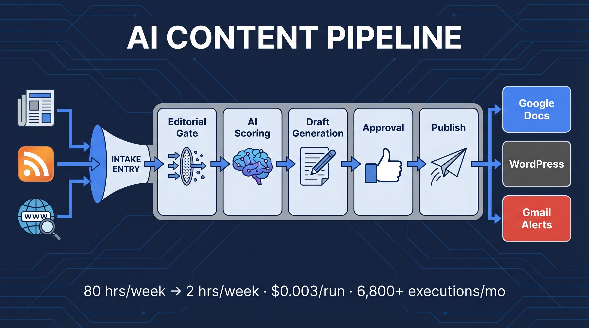
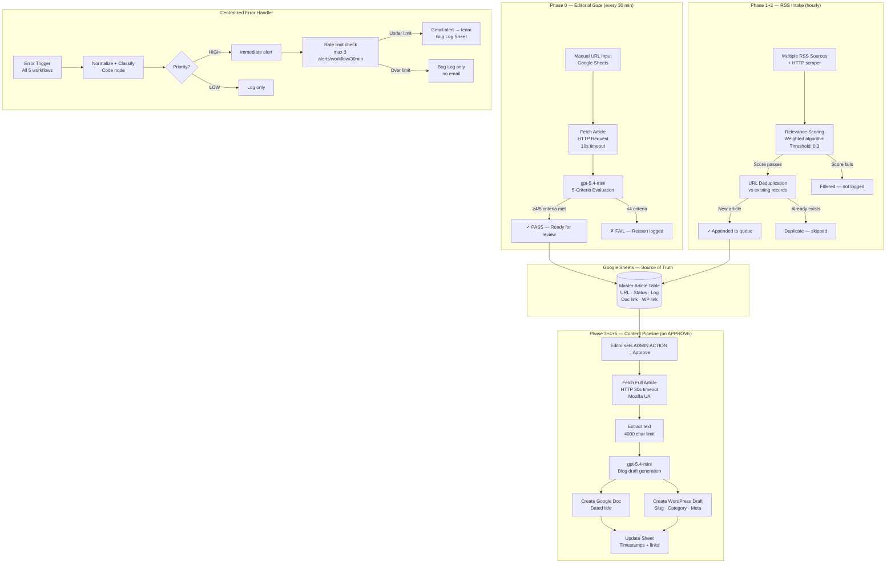
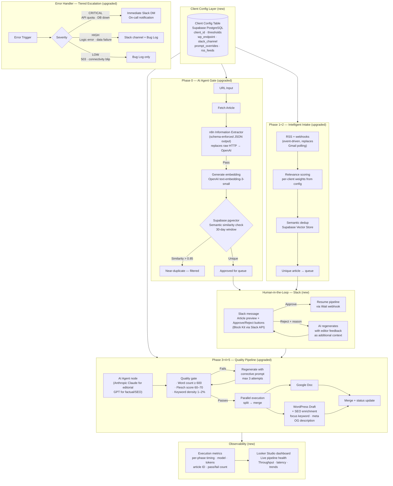
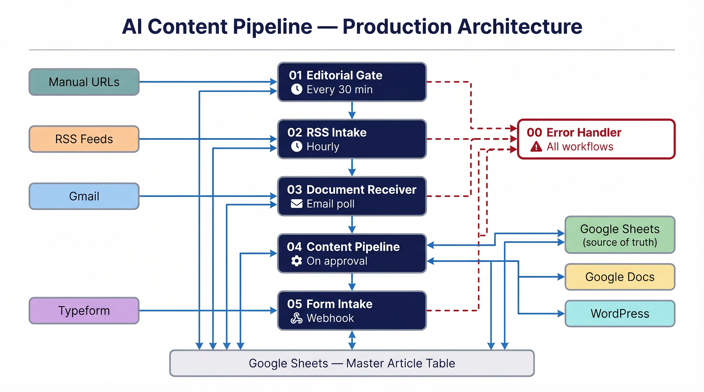

# AI Content Pipeline


Most content operations waste their most expensive resource — editorial judgment — on mechanical work. This pipeline separates the two. AI handles sourcing, screening, and drafting. Editors handle approval. Everything else is automated.

Built on n8n Cloud. Running in production. 6,800+ executions per month at $0.003 per run.

> **Portfolio note:** Client details have been anonymized. Production metrics are real. Placeholder values marked `[CLIENT]`, `[AGENCY_DOMAIN]`, etc. in workflow files are the only modifications from the live system.

---

## Contents

- [Business Impact at a Glance](#business-impact-at-a-glance)
- [The Problem](#the-problem)
- [What It Builds](#what-it-builds)
- [Phase 1 Architecture (Production)](#phase-1-architecture-production)
- [Key Engineering Decisions](#key-engineering-decisions)
- [Security Architecture](#security-architecture)
- [Production Metrics](#production-metrics)
- [Phase 2: Enterprise Architecture](#phase-2-enterprise-architecture)
- [Who Uses This](#who-uses-this)
- [Tech Stack](#tech-stack)
- [Getting Started](#getting-started)
- [Lessons Learned](#lessons-learned)

---

## Business Impact at a Glance

| Before | After |
|--------|-------|
| 80+ hrs/week in mechanical editorial work | 2–4 hrs/week for editor review and approvals |
| ~$5,000/week in production costs at $65/hr | ~$20/month in API fees |
| Quality inconsistency — criteria drift under deadline pressure | Consistent 5-criteria AI gate on every article, every time |
| No visibility into what failed or why | Centralized error log + classified alerts with rate limiting |
| One team, one publication | Phase 2 architecture supports 10+ clients from one instance |

A media company publishing 200 pieces per month replaces $8,000–$12,000 in monthly editorial production costs with $20 in API fees and a few hours of editor time. The editors don't disappear — their time shifts from mechanical production to actual editorial judgment, which is what they were hired for.

---

## The Problem

Content teams running high-volume publishing operations spend most of their time on mechanics, not editorial judgment. Sourcing articles, evaluating sources for relevance and quality, drafting, formatting, SEO tagging, and pushing to WordPress — at an operation producing 15–20 pieces per week, that's roughly 80 hours of mechanical editorial work weekly. At a $65/hr blended editorial rate, that's over $5,000 in weekly production cost that has nothing to do with actual writing or editorial judgment.

The deeper problem is consistency. When a human manually evaluates article sources under deadline pressure, criteria drift. What clears the bar on a slow Tuesday morning is not the same as what clears it on a Friday afternoon with three pieces still in queue. You end up with a corpus that varies in quality, topic focus, and brand alignment not by editorial decision but by whoever was working that day.

Enterprise operations face a third problem that agencies often don't: auditability. Regulated industries — finance, legal, healthcare, compliance — need to answer "who approved this, what model generated it, and when?" before they can publish AI-assisted content at scale. Without that trail built into the pipeline from the start, AI-assisted content isn't deployable in those environments regardless of quality.

This pipeline addresses all three. The mechanical layer — sourcing, screening, drafting, publishing — runs automatically at fractions of a cent per article. The consistency layer is a 5-criteria AI gate that applies the same editorial standard to every piece, every time. The audit layer is an append-only log with timestamps, model identifiers, and approval records on every action. Editors remain in the workflow through an approval gate before anything goes live.

---

## What It Builds

Six interconnected n8n workflows that form a complete content production pipeline:

1. **Editorial Gate** evaluates manually-submitted article URLs against a 5-criteria quality rubric using gpt-5.4-mini. Articles that pass go into the approval queue. Rejections are logged with a specific reason.
2. **RSS Intake** pulls from multiple industry sources on a schedule, runs each article through a weighted relevance scoring algorithm, and deduplicates against existing content before appending to the queue.
3. **Content Pipeline** triggers when an editor approves an article, fetches the full text, generates a complete blog draft via AI, creates a Google Doc, posts a WordPress draft, and logs timestamps and links back to the source sheet.
4. **Form Intake** handles new submissions via webhook, routes by submission type, deduplicates against existing records, and appends to the master sheet.
5. **Document Receiver** monitors for document completion notifications via email, processes them, and updates the corresponding record.
6. **Error Handler** runs as a centralized error receiver for all five workflows. It classifies errors by priority, enforces email rate limiting, and maintains an audit log.

---

## Phase 1 Architecture (Production)



### Phase Breakdown

**Phase 0 — Editorial Gate**
Evaluates manually-submitted URLs before they enter the production queue. Each article is fetched, text extracted, and evaluated against five criteria: topic focus for the target market, presence of credible data or research, financial/operational relevance, source credibility, and timeless applicability. An article needs to meet at least 4 of 5 to pass. Hard-fail conditions bypass scoring entirely (off-topic verticals, investment-focused content that doesn't serve the target audience).

This gate runs every 30 minutes as a scheduled check, not on-demand — which means editors can submit URLs in bulk and come back to results. Response time is typically under 8 seconds per article.

**Phase 1+2 — RSS Intake**
Pulls from multiple source feeds hourly. Each article title and description goes through a weighted scoring algorithm before any fetch occurs, which keeps API and HTTP costs down by filtering at the cheapest possible point. Articles that pass scoring are checked for URL duplicates before being appended to the master sheet. There's no fuzzy matching here — that's in the Phase 2 architecture below.

**Phase 3+4+5 — Content Pipeline**
Triggered by a Google Sheets row update when an editor marks an article approved. The workflow fetches the full article text (with a realistic browser User-Agent to avoid 403s on strict sites), generates a complete draft, and outputs to both a Google Doc and a WordPress draft post simultaneously. Status, links, and timestamps are written back to the source row so editors can track exactly where every article is.

**Error Handler**
All five workflows are configured to route failures here. The handler normalizes error data, classifies by priority (HIGH for logic/code failures, LOW for connectivity and transient service errors), checks an email rate-limit counter per workflow, and sends structured Gmail alerts. Without the rate limiter, a 10-minute service outage from a single external API can generate 40+ emails — a problem we hit on day two of production.

---

## Key Engineering Decisions

### 1. Google Sheets as the source of truth

The obvious choice for a system like this would be a proper database. We chose Google Sheets for Phase 1 for specific reasons: the editorial team already lives in Sheets, the approval workflow (setting a cell value) requires no training, and n8n reads and writes to Sheets natively with retry support.

The trade-off is real. Sheets doesn't handle concurrent writes from multiple workflow instances, doesn't have proper indexing, and starts slowing down above 10,000 rows. At one client and ~200 articles/month, none of this matters. At 10 clients or 50,000 records annually, you migrate to PostgreSQL. Phase 2 architecture documents exactly what that migration looks like.

### 2. Weighted relevance scoring instead of keyword matching

Keyword matching was the first approach. It doesn't work. An article that mentions the target topic once in passing scores the same as a deep analysis. You end up with a lot of technically matching but editorially useless articles making it into the queue.

The weighted algorithm assigns scores based on signal strength:
- **+0.5** for primary topical signals (core subject matter of the publication)
- **+0.3** for institutional source references (credible industry organizations)
- **+0.2** for geographic or demographic markers relevant to the target audience
- **−0.5** for strong off-topic signals (different market, different sector)
- **−0.3** for weak relevance (global content with no angle for the target audience)

A threshold of 0.3 was calibrated against 200 manually reviewed articles. The algorithm is configurable per client in the Phase 2 multi-tenant architecture — different publications, different weights, no workflow changes required.

### 3. `pairedItem` tracking through `splitInBatches` loops

This is the single most important implementation detail in the workflow, and the one most likely to break if you skip it.

When n8n processes items in a `splitInBatches` loop, the relationship between the output of later nodes and the originating input item is lost unless you explicitly declare it through `pairedItem`. Without it, when the status update node at the end of Phase 3+4+5 tries to write back to the source Google Sheets row, it either writes to the wrong row or throws `Cannot read properties of undefined`. The data looks fine in the intermediate nodes — the bug only surfaces at the write step.

The fix is declaring `pairedItem: { item: 0 }` on every output item inside the loop. It's a one-line change that took significant debugging to identify.

### 4. Email rate limiting on the error handler

On day two of production, the WordPress API returned 503s for about 10 minutes due to a server restart. The Phase 3+4+5 workflow was mid-run processing 8 articles. Every article triggered the error handler. The error handler sent an email. We received 40 emails in 10 minutes about the same transient outage.

The rate limiter reads a per-workflow error count from the Bug Log sheet at execution time. If the count exceeds 3 within the last 30 minutes for that specific workflow, it writes to the log but skips the email. The counter resets naturally as the 30-minute window rolls forward. This is implemented in a Code node — no external service required, no Redis dependency.

### 5. Idempotency keys on the content pipeline

A workflow timeout or n8n Cloud maintenance window mid-execution creates a partial run. Without idempotency, restarting the workflow creates a second Google Doc and a second WordPress draft for the same article. At scale, this fills the content queue with duplicates that editors then have to manually identify and delete.

The fix: generate a UUID at the start of each Phase 3+4+5 execution and write it to the source row before any API calls. Before creating a Doc or WordPress post, the workflow checks whether a resource with this execution ID already exists. If it does, it skips creation and uses the existing resource. One Code node check per creation step.

### 6. HMAC-SHA256 signature verification on webhook intake

The form intake workflow is triggered by a webhook. An unsigned webhook URL is an open injection endpoint — anyone who discovers it can push arbitrary data into the pipeline. The form submission platform sends a SHA256 HMAC signature in a request header. The first Code node in the intake workflow computes the expected signature from the shared secret and raw request body, then compares it to the header value. Mismatches terminate execution immediately.

### 7. Retry configuration on Sheets writes (3 retries, 3s fixed wait)

Google Sheets API errors are quota-based, not load-based. After a 429 response, the quota resets on a fixed schedule — typically within a few seconds for write quotas. Exponential backoff (1s, 2s, 4s...) doesn't help here because the quota window is fixed, and adding more delay increases the total execution time without improving the retry success rate. Three retries at a fixed 3-second interval is the right shape for Sheets-specific rate limits.

---

## Security Architecture

| Control | Implementation |
|---------|---------------|
| Webhook authentication | HMAC-SHA256 verification in intake Code node — execution stops immediately on signature mismatch |
| Credential storage | All API keys and service credentials stored in n8n Credential Store — never in workflow JSON or version control |
| Email rate limiting | Max 3 alert emails per workflow per 30-minute window — prevents unintentional inbox flooding during outages |
| Input validation | Code nodes validate field presence and type before any external API call — rejects malformed payloads early |
| Error message sanitization | Error alerts contain node name and error type only — no system paths, no credential fragments, no raw stack traces |
| Audit log | Every pipeline action (article processed, approved, rejected, draft created, error triggered) is written to an append-only Google Sheet with timestamp and actor |

---

## Production Metrics

| Metric | Value |
|--------|-------|
| Monthly executions | 6,800+ |
| Cost per execution | $0.003 |
| Monthly API cost | ~$20 USD |
| Active workflows | 6 |
| Backup / archived workflows | 5 |
| Custom JavaScript Code nodes | 24+ |
| External services integrated | 8 |
| Avg. article processing time | ~45 seconds (fetch → draft → published) |
| Editorial work eliminated | ~80% |
| Error alert rate (enforced cap) | ≤3 per workflow per 30 min |
| Retry coverage | All Sheets write operations (3×, 3s fixed) |

---

## Phase 2: Enterprise Architecture

The Phase 1 system works well for one client. These are the specific things that would need to change to serve 10+ clients from a single pipeline instance.



### What changes and why

| Phase 1 | Phase 2 | Reason |
|---------|---------|--------|
| HTTP Request → OpenAI (raw JSON parse) | n8n Information Extractor node | Schema-enforced output, no fragile string parsing |
| URL-based deduplication | Semantic similarity via pgvector | Catches the same story from two different sources |
| Spreadsheet cell approval | Slack Approve/Reject buttons | Editors approve in 10 seconds without opening a browser |
| gpt-5.4-mini flat routing | Claude (editorial) / GPT (factual) | ~40% cost reduction, better narrative quality |
| No quality gate on output | Word count + readability + keyword density | System self-corrects before a draft reaches editors |
| Single client hardcoded | Client config table (Supabase) | Add a new client by adding one database row |
| No pipeline visibility | Execution metrics + Looker Studio | Answer "is it working right now?" without opening n8n |
| Email-only alerts | Tiered escalation (Slack DM / channel / log) | Critical failures get immediate attention; low-priority noise stays out of inboxes |

**All Phase 2 items are verified feasible in current n8n** (April 2026): Information Extractor (`nodes-langchain.informationExtractor`), Supabase Vector Store (`nodes-langchain.vectorStoreSupabase`), OpenAI Embeddings (`nodes-langchain.embeddingsOpenAi`), Anthropic Chat Model (`nodes-langchain.lmChatAnthropic`), AI Agent (`nodes-langchain.agent`), Merge node (`nodes-base.merge`), Wait node with webhook resume (`nodes-base.wait`), Google Calendar (`nodes-base.googleCalendar`).

---

## Who Uses This

### Corporate Media Publishers
Trade and industry publications running multiple titles with editorial teams at capacity. The pipeline handles sourcing and drafting volume; editors review and approve. The practical value is that a two-person editorial team can operate at the throughput of six without sacrificing editorial standards. At a typical B2B media company, that's $200k–$300k/year in avoided headcount, with lower error rates and faster turnaround than a fully manual process.

### Marketing Agencies
Agencies managing content programs for 10–20 brand clients simultaneously. The Phase 2 multi-tenant config makes this deployable per-client from one n8n instance: separate scoring rules, publishing endpoints, Slack channels, and prompt overrides per client, all driven by a config table. Adding a new client is adding a database row, not building a new workflow. An agency billing $3,000–$8,000/month per client for managed content operations can run this infrastructure at under $200/month across all clients.

### Enterprise SaaS Companies
Content marketing teams publishing 40–60 pieces per month to drive organic growth. At that volume, the bottleneck is never writing — it's the pipeline: getting from "here's a good source" to "published post with correct slug, meta description, categories, OG tags, and internal links." This system handles all of that. Editorial teams stay focused on strategy, not WordPress administration.

### Management Consulting and Financial Advisory Firms
High-volume thought leadership at firms without in-house content teams. The human approval gate is specifically designed for regulated or reputation-sensitive environments: no AI-generated content goes live without a named editor sign-off, and the audit log records exactly which human approved what, and when. For firms billing $300–$500/hr for advisory work, having partners spend time on content formatting is a cost they don't always recognize until someone puts a number on it.

### Legal Tech and Compliance Platforms
Publishers of regulatory updates, compliance guidance, and client-facing summaries. These organizations often have mandatory review requirements before publication. The audit log (immutable, timestamped, model-tracked), approval gate, and error log aren't nice-to-haves here — they're prerequisites for using AI in the publishing pipeline at all. Built-in from day one rather than retrofitted later.

---

## Tech Stack

| Layer | Technology | Notes |
|-------|-----------|-------|
| Workflow engine | n8n Cloud | 6 active workflows, sub-workflow error routing |
| AI model | OpenAI gpt-5.4-mini | typeVersion 2.1 (evaluation), 1.8 (drafting) |
| Content sources | HTTP Request (RSS + scraping) | Multi-source with relevance scoring |
| Source of truth | Google Sheets | Master article table + Bug Log |
| Document output | Google Docs | Via Google Docs API node |
| Publishing target | WordPress REST API | Draft post creation with slug, category, meta |
| Notifications | Gmail | Rate-limited structured alerts |
| Scheduling | n8n Schedule Trigger | 30-min (P0), hourly (P1+P2) |
| Webhook intake | n8n Webhook | HMAC-SHA256 authenticated |
| Error routing | n8n Error Trigger | Centralized per-workflow routing |
| Code logic | JavaScript (Code node) | 24+ custom nodes for scoring, parsing, formatting |

---

## Getting Started

See **[SETUP.md](SETUP.md)** for full setup instructions including:
- Prerequisites and account requirements
- Credential configuration per service
- Google Sheets column structure (master table + bug log)
- Workflow import order (error handler must be imported first)
- Activation sequence
- Testing the pipeline end-to-end

---

## Lessons Learned

**1. pairedItem tracking is not optional in loops.**
We didn't encounter the bug until the third production run with 8 articles in a batch. All intermediate nodes looked fine. The status update wrote to the wrong rows for 6 of the 8 articles. Always test loops with at least 3 items and verify that terminal write operations hit the correct source rows.

**2. Build the error handler before the main workflows, not after.**
We added it as an afterthought on day two. Until then, there was no visibility into failures. Failures in n8n Cloud that don't have an error handler configured just silently stop execution — there's no automatic notification. Building the error handler first means you have observability from the first production execution.

**3. Alert fatigue is an actual incident.**
40 emails in 10 minutes from a transient 503 is enough to make engineers start ignoring the error mailbox. Once that happens, real failures get missed. Rate-limit error alerts from day one.

**4. gpt-5.4-mini needs explicit output constraints in the system prompt.**
Without "write a minimum of 800 words, maximum 1,200 words" in the prompt, the model produces outputs that vary wildly in length — sometimes 300 words, sometimes 2,000. Length constraints are not the model being restrictive; they're the model being calibrated to your editorial standard.

**5. Idempotency should be designed in, not added later.**
We added it after a timeout during a 12-article batch created 12 duplicate WordPress drafts that had to be manually cleaned up. It took 20 minutes to clean and 10 minutes to implement the fix. The correct order was obvious in retrospect.

---

## Workflow Architecture



All 6 workflows run on n8n Cloud. Red dashed arrows show error routing — every workflow routes failures to the centralized error handler. White arrows show the primary data flow: articles pass through the Editorial Gate and RSS Intake into the Content Pipeline, which outputs to Google Docs and WordPress simultaneously. The Form Intake and Document Receiver are independent intake channels that feed the same master sheet.

---

## Repository Structure

```
ai-content-pipeline/
├── README.md                     ← You are here
├── SETUP.md                      ← Full import and credential guide
├── docs/
│   └── overview.jpg              ← Architecture hero image
└── workflows/
    ├── 00-error-handler.json     ← Import this first — all others route errors here
    ├── 01-editorial-gate.json    ← Phase 0: URL quality evaluation
    ├── 02-rss-intake.json        ← Phase 1+2: RSS scraping and scoring
    ├── 03-document-receiver.json ← Document completion handler
    ├── 04-content-pipeline.json  ← Phase 3+4+5: The main production pipeline
    └── 05-form-intake.json       ← Webhook-based form intake handler
```

---

*Built by [Rex Quintenta](https://github.com/RexOwenDev) — open to engineering roles in AI automation, workflow architecture, and full-stack development.*
