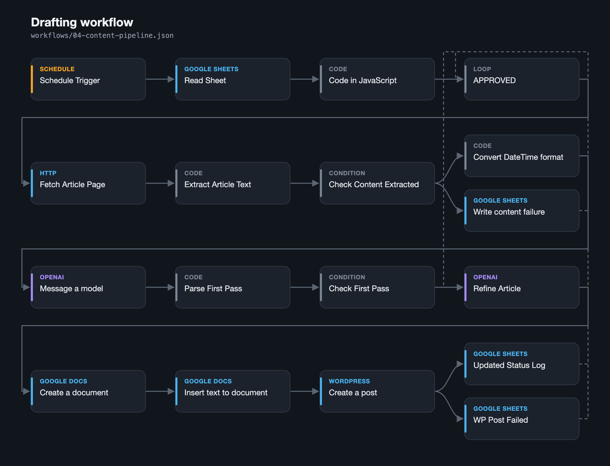
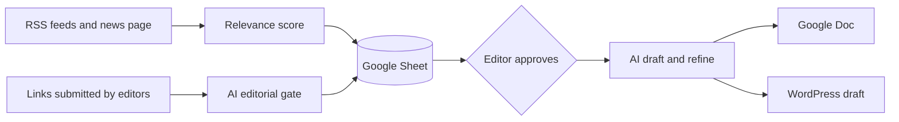
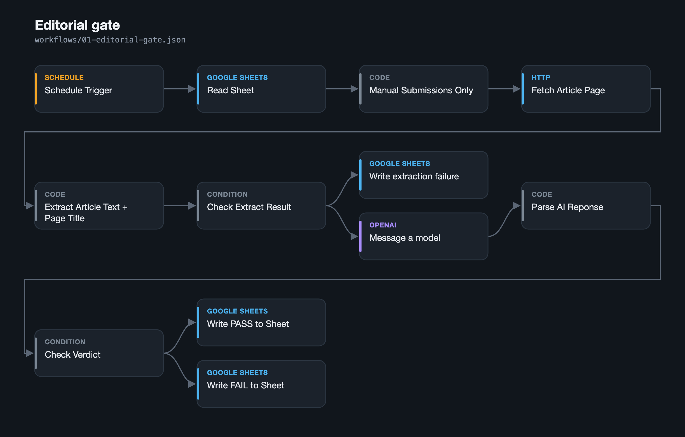

# AI Content Pipeline

Finds industry articles, screens them with AI against an editorial checklist and turns the ones an editor approves into Google Docs and WordPress drafts.

**Built for** publishers, agencies and marketing teams that produce steady industry content and want editors spending their time on judgment instead of copy and paste.

**Where it comes from:** a live n8n Cloud project for a financial services client. Client names, links and credentials are replaced with placeholders.

## How it works

1. **Collect.** Every hour, the intake workflow reads industry RSS feeds and an industry association news page, scores each article for relevance and adds the ones that reach the threshold to a Google Sheet.
2. **Screen.** Every 30 minutes, the editorial gate fetches links that editors submitted by hand and asks `gpt-5.4-mini` to check them against five criteria. An article passes when it meets at least four. Pass or fail, the reason is written back to the sheet.
3. **Approve.** An editor marks the articles worth writing about as approved in the sheet.
4. **Draft.** Every 30 minutes, the drafting workflow takes approved rows, extracts up to 4,000 characters of the source article, writes a first draft with `gpt-5.4-mini`, checks it and refines it. It then creates a Google Doc and a WordPress draft post and writes both links back to the sheet.
5. **Alert.** Failures from every workflow go to one error workflow. It logs them to a bug log sheet and emails the team, at most three emails per workflow every 30 minutes.

```mermaid
flowchart LR
    A[RSS feeds and news page] --> B[Relevance score]
    B --> S[(Google Sheet)]
    C[Links submitted by editors] --> D[AI editorial gate]
    D --> S
    S --> E{Editor approves}
    E --> F[AI draft and refine]
    F --> G[Google Doc]
    F --> H[WordPress draft]
```

## Workflows

| File | Starts when | What it does |
| --- | --- | --- |
| `00-error-handler.json` | Any workflow fails | Logs the error and sends a capped email alert |
| `01-editorial-gate.json` | Every 30 minutes | Screens submitted links against five criteria |
| `02-rss-intake.json` | Every hour | Collects and scores articles from feeds |
| `04-content-pipeline.json` | Every 30 minutes | Drafts approved articles into Google Docs and WordPress |
| `05-form-intake.json` | A website form is submitted | Checks the form signature, skips duplicates and sends the next step email |
| `03-document-receiver.json` | A signed document email arrives | Marks the matching lead as signed in the sheet |

The last two come from the same client project and handle its lead intake, not content.

## Reliability

* Google Sheets writes retry three times, three seconds apart.
* Article text is trimmed to 4,000 characters before it reaches the model, which keeps cost and draft length predictable.
* WordPress posts are always created as drafts. Nothing is published automatically.
* Temporary "Service unavailable" errors are skipped instead of emailed.
* Form submissions are rejected unless their HMAC signature matches.
* Credentials stay in the n8n credential store. The JSON files contain placeholders only.

## Set up

Follow [SETUP.md](SETUP.md) for accounts, credentials, sheet columns and activation. Import `00-error-handler.json` first so the other workflows can report errors.

## Good to know

* The prompts, keyword lists and sheet layout are written for one publication. Adapting them to another audience means editing the scoring and prompt nodes.
* Execution history and costs from the live project are not included.

Built by Rex Owen Quintenta · [Email](mailto:owenquintenta@gmail.com) · [LinkedIn](https://linkedin.com/in/owendev) · [Upwork](https://www.upwork.com/freelancers/~016d94e91b51fc9dec)
